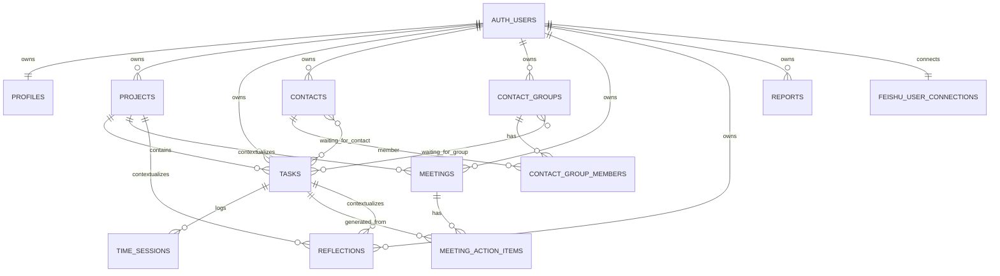

# WorkOS Data Model V1

更新日期：2026-06-24

说明：这里的 `V1` 指“当前 WorkOS 数据模型审阅版”。代码里的 `WorkData.version = 2` 是本地数据结构版本号，不等同于本文档版本。

## 1. ER Diagram



核心关系：

- `auth.users` 是所有云端数据的归属根节点，业务表都通过 `user_id` 做隔离。
- `projects -> tasks / meetings / reflections` 是项目上下文。
- `tasks -> time_sessions` 是工时来源；任务上的 `actualHours` 是计算值，不是独立事实。
- `meetings -> meeting_action_items -> tasks` 支持从会议行动项生成任务。
- `contacts / contact_groups` 是等待对象和飞书通讯录的基础数据。
- `feishu_user_connections` 保存个人日历 OAuth 连接，不保存到前端 WorkData。

## 2. Supabase Schema

### 2.1 账号与连接

| Table | 关键字段 | 关系 | 用途 |
| --- | --- | --- | --- |
| `profiles` | `id`, `user_id`, `email`, `display_name` | `user_id -> auth.users.id` | WorkOS 用户资料 |
| `feishu_user_connections` | `user_id`, `feishu_open_id`, `feishu_user_id`, `access_token`, `refresh_token`, `expires_at` | `user_id -> auth.users.id` | 飞书个人日历 OAuth token |

注意：`feishu_user_connections` 的写入由服务端 Admin Client 完成。前端状态接口只返回连接状态、姓名/邮箱和过期时间，不返回 token。

### 2.2 任务与时间

| Table | 关键字段 | 关系 | 用途 |
| --- | --- | --- | --- |
| `tasks` | `id`, `user_id`, `title`, `description`, `source`, `requester`, `created_by`, `project_id`, `status`, `priority`, `due_date`, `estimated_hours`, `completed_at` | `project_id -> projects.id` | 任务主体 |
| `tasks` | `subtasks jsonb`, `auto_complete_on_subtasks_done` | embedded | 子任务清单与自动完成开关 |
| `tasks` | `waiting_for_type`, `waiting_for_id`, `waiting_reason`, `follow_up_date` | soft reference | 等待联系人/群组 |
| `tasks` | `notes`, `waiting_for`, `tags` | legacy | 旧数据兼容 |
| `time_sessions` | `id`, `user_id`, `task_id`, `start_time`, `end_time`, `duration_seconds` | `task_id -> tasks.id` | 实际工时记录 |
| `time_sessions` | `original_*`, `corrected_*`, `edited_by`, `edited_at`, `edit_reason` | correction metadata | 工时修正记录 |

任务状态枚举：`Inbox / Todo / Doing / Waiting / Done`

优先级枚举：`P0 / P1 / P2 / P3`

当前时间模型：

- Start：只写 UI 内存态，不立即写 DB。
- Stop/Pause：生成一条完整 `time_sessions`，包含 `start_time`, `end_time`, `duration_seconds`。
- `actualHours`：由 `time_sessions.duration_seconds` 汇总得到。
- `time_sessions.is_running` 仍在表里，但当前代码保存时固定写 `false`，属于历史兼容字段。

### 2.3 项目

| Table | 关键字段 | 关系 | 用途 |
| --- | --- | --- | --- |
| `projects` | `id`, `user_id`, `name`, `type`, `background`, `goal`, `status`, `priority`, `progress`, `start_date`, `due_date`, `risks`, `next_action` | owned by user | 项目档案 |

项目状态枚举：`Planning / Active / Paused / Done`

注意：前端 `Project.relatedTaskIds` 不是数据库字段，而是加载时从 `tasks.project_id` 反推出来。

### 2.4 会议

| Table | 关键字段 | 关系 | 用途 |
| --- | --- | --- | --- |
| `meetings` | `id`, `user_id`, `title`, `date`, `duration_minutes`, `attendees`, `notes`, `decisions`, `related_project_id` | `related_project_id -> projects.id` | 会议主体 |
| `meetings` | `external_source`, `external_id`, `location`, `meeting_url`, `calendar_id`, `organizer_id`, `raw_payload` | Feishu metadata | 飞书日历同步字段 |
| `meeting_action_items` | `id`, `user_id`, `meeting_id`, `text`, `owner`, `due_date`, `task_id` | `meeting_id -> meetings.id`, `task_id -> tasks.id` | 会议行动项 |

`Meeting.actionItems` 在前端是嵌套数组，数据库里是单独表 `meeting_action_items`。

### 2.5 联系人与群组

| Table | 关键字段 | 关系 | 用途 |
| --- | --- | --- | --- |
| `contacts` | `id`, `user_id`, `name`, `role`, `team`, `company`, `email`, `phone`, `notes` | owned by user | 联系人基础信息 |
| `contacts` | `external_source`, `external_id`, `feishu_user_id`, `feishu_open_id`, `feishu_union_id`, `avatar`, `department_id`, `department_name`, `status`, `raw_payload` | Feishu metadata | 飞书通讯录同步字段 |
| `contact_groups` | `id`, `user_id`, `name`, `description`, `contact_ids` | owned by user | 群组基础信息 |
| `contact_groups` | `external_source`, `external_id`, `feishu_chat_id`, `owner_id`, `member_count`, `raw_payload` | Feishu metadata | 飞书群组同步字段 |
| `contact_group_members` | `id`, `user_id`, `group_id`, `contact_id`, `feishu_user_id`, `open_id`, `role`, `joined_at`, `raw_payload` | `group_id -> contact_groups.id`, `contact_id -> contacts.id` | 群成员关系 |

当前有两套群成员表示：

- `contact_groups.contact_ids`：前端主要读取的群成员 ID 数组。
- `contact_group_members`：飞书群成员同步的关系表。

这两者需要保持一致，否则页面显示和同步统计可能不一致。

### 2.6 复盘与报告

| Table | 关键字段 | 关系 | 用途 |
| --- | --- | --- | --- |
| `reflections` | `id`, `user_id`, `title`, `content`, `type`, `related_project_id`, `related_task_id`, `date`, `duration_minutes`, `tags` | optional project/task refs | 复盘、沉淀、思考 |
| `reports` | `id`, `user_id`, `title`, `type`, `start_date`, `end_date`, `generated_content`, `included_task_ids`, `included_reflection_ids`, `options` | denormalized ids | 报告生成结果 |

复盘类型枚举：`问题复盘 / 流程优化 / 风险提醒 / 经验沉淀 / 自动化想法 / 管理思考`

报告类型枚举：`日报 / 周报 / 月报 / 季度报 / 自定义`

## 3. API Model

### 3.1 前端 WorkData

```ts
WorkData {
  version: 2
  tasks: Task[]
  projects: Project[]
  meetings: Meeting[]
  reflections: Reflection[]
  reports: Report[]
  contacts: Contact[]
  contactGroups: ContactGroup[]
}
```

核心 API 模型：

| Model | 主要字段 | 数据来源 |
| --- | --- | --- |
| `Task` | `title`, `description`, `status`, `priority`, `dueDate`, `estimatedHours`, `actualHours`, `subtasks`, `waitingForType`, `waitingForId`, `timeTracking` | `tasks` + `time_sessions` |
| `Subtask` | `id`, `title`, `done`, `order`, `createdAt`, `updatedAt`, `completedAt` | `tasks.subtasks jsonb` |
| `Project` | `name`, `type`, `goal`, `status`, `progress`, `relatedTaskIds`, `risks` | `projects` + derived task ids |
| `Meeting` | `title`, `date`, `durationMinutes`, `attendees`, `decisions`, `actionItems`, `externalSource` | `meetings` + `meeting_action_items` |
| `Contact` | `name`, `role`, `team`, `email`, `avatar`, `departmentName`, `externalSource` | `contacts` |
| `ContactGroup` | `name`, `description`, `contactIds`, `memberCount`, `externalSource` | `contact_groups` |
| `Reflection` | `title`, `content`, `type`, `relatedProjectId`, `relatedTaskId`, `date` | `reflections` |
| `Report` | `title`, `type`, `date range`, `generatedContent`, `included ids`, `options` | `reports` |

### 3.2 Supabase Repository 映射

加载逻辑：

1. 并行读取 `projects`, `tasks`, `time_sessions`, `meetings`, `meeting_action_items`, `reflections`, `reports`, `contacts`, `contact_groups`。
2. 用 `time_sessions` 聚合出每个任务的 `timeTracking.sessions` 和 `actualHours`。
3. 用 `tasks.project_id` 反推出每个项目的 `relatedTaskIds`。
4. 用 `meeting_action_items.meeting_id` 拼回 `Meeting.actionItems`。

保存逻辑：

1. upsert `contacts`
2. upsert `contact_groups`
3. upsert `projects`
4. upsert `tasks`
5. 替换当前用户全部 `time_sessions`
6. upsert `meetings`
7. 替换当前用户全部 `meeting_action_items`
8. upsert `reflections`
9. upsert `reports`
10. 删除本次 WorkData 里已不存在的旧行

### 3.3 飞书 API Routes

| Route | Method | 输入 | 输出 | 写入表 |
| --- | --- | --- | --- | --- |
| `/api/integrations/feishu/status` | GET | 登录态 | `configured`, `personalCalendarConnected`, `stats`, `lastSyncedAt` | 不写入 |
| `/api/integrations/feishu/oauth/connect` | POST | 登录态 | `url`, `redirectUri` | 不写入 |
| `/api/integrations/feishu/oauth/callback` | GET | `code`, `state` | redirect app | `feishu_user_connections` |
| `/api/integrations/feishu/oauth/disconnect` | POST | 登录态 | `ok` | 删除 `feishu_user_connections` |
| `/api/integrations/feishu/sync` | POST | `action`, `startDate`, `endDate` | `stats`, `logs`, `warnings` | `contacts`, `contact_groups`, `contact_group_members`, `meetings` |

同步 action：

- `test`：测试飞书连接。
- `contacts`：同步组织通讯录到 `contacts`。
- `groups`：同步群组到 `contact_groups`。
- `members`：同步群成员到 `contacts` + `contact_group_members`。
- `meetings`：用个人 OAuth 同步日历会议到 `meetings`。
- `all`：联系人、群组、群成员、会议一起同步。

飞书同步来源：

- 联系人/群组/群成员：使用应用身份 `tenant_access_token`。
- 个人会议：线上使用飞书 OAuth 用户身份 `access_token`。
- CLI 只作为本地开发 fallback；生产环境不能依赖 CLI 登录态。

## 4. 页面映射关系

| 页面 | View | 读取模型 | 写入/操作 |
| --- | --- | --- | --- |
| 今日概览 | `today` | `tasks`, `projects` | 打开任务详情、跳转项目/等待视图 |
| 收集箱 | `inbox` | `tasks(status=Inbox)` | 任务转 Todo、删除任务 |
| 任务中心 | `tasks` | `tasks`, `projects`, `contacts`, `contactGroups` | 新建/编辑/删除任务、子任务、计时、状态切换、等待对象选择 |
| 项目中心 | `projects` | `projects`, `tasks`, `meetings`, `reflections` | 新建/编辑/删除项目 |
| 会议中心 | `meetings` | `meetings`, `projects`, `tasks` | 新建/编辑/删除会议、从行动项生成任务 |
| 等待看板 | `waiting` | `tasks(status=Waiting)`, `contacts`, `contactGroups` | 更新等待任务、查看等待对象 |
| 协作总览 | `collaboration` | `contacts`, `contactGroups`, `meetings`, `tasks` | 跳转联系人/群组/等待 |
| 联系人 | `contacts` | `contacts`, `contactGroups` | 新建/编辑/删除联系人、保存联系人 |
| 群组 | `groups` | `contactGroups`, `contacts` | 新建/编辑/删除群组、维护成员 |
| 工作日志 | `log` | `tasks.timeTracking`, `meetings`, `reflections` | 查看任务、会议、复盘明细 |
| 每周复盘 | `weekly` | `tasks`, `projects`, `meetings`, `reflections` | 生成/保存复盘数据 |
| 报告中心 | `reports` | `tasks`, `projects`, `reflections`, `reports` | 生成/保存报告 |
| 工时分析 | `analytics` | `tasks.timeTracking` | 只读分析 |
| 工作分析中心 | `workAnalytics` | `tasks`, `meetings`, `reflections`, `projects` | 只读分析、打开详情 |
| 思考空间 | `thinking` | `reflections`, `projects`, `tasks` | 新建/编辑/删除复盘 |
| 显示设置 | `display` | localStorage display settings | 改 UI 字号/宽度/密度 |
| 工作空间设置 | settings modal | auth 状态、飞书 status、WorkData 统计 | 云端导入、飞书连接/同步、导出/恢复演示数据 |

## 5. 当前映射注意点

1. `Task.actualHours` 不是 Supabase 字段，而是由 `time_sessions` 汇总。判断工时问题时应看 `time_sessions`。
2. `Project.relatedTaskIds` 不是 Supabase 字段，而是从 `tasks.project_id` 派生。
3. `Task.subtasks` 存在 `tasks.subtasks jsonb`，不是单独 `subtasks` 表。好处是简单，代价是无法方便做跨任务子任务查询。
4. `waiting_for_type + waiting_for_id` 是软关联，没有数据库外键。`waiting_for_type=contact` 时指向 `contacts.id`，`group` 时指向 `contact_groups.id`。
5. `waiting_for`, `notes`, `tags` 仍保留为 legacy 字段，UI 已弱化/迁移，但数据库还没清理。
6. 群成员现在同时存在 `contact_groups.contact_ids` 和 `contact_group_members`。后续最好统一成一个主来源，否则同步统计和页面成员数可能不一致。
7. `time_sessions.is_running` 仍存在，但当前保存逻辑不会把运行中计时写入 DB。真正可信字段是 `start_time`, `end_time`, `duration_seconds`。
8. `reports.included_task_ids` 和 `included_reflection_ids` 是数组引用，没有外键约束，删除任务/复盘后报告里可能保留历史 ID。
9. `/api/integrations/feishu/status` 里的 `cliConnected` 当前实际表示“飞书应用环境变量已配置”，不是 CLI 在线状态，命名容易误解。
10. `save()` 会删除当前 WorkData 中不存在的 contacts/groups。若页面持有的是旧快照，理论上可能覆盖刚同步的新联系人；同步后应尽快刷新云端数据。

## 6. 建议的下一步

优先级从高到低：

1. 把群成员主来源统一为 `contact_group_members`，前端 `contactIds` 从关系表派生。
2. 把 `waiting_for_id` 做成应用层强校验，避免联系人/群组删除后等待任务悬空。
3. 明确 legacy 字段清理计划：`tags`, `notes`, `waiting_for`。
4. 将 `cliConnected` 重命名为 `configured` 或 `appConfigured`。
5. 如果未来要对子任务做跨任务看板，再把 `tasks.subtasks jsonb` 拆成独立 `subtasks` 表。
